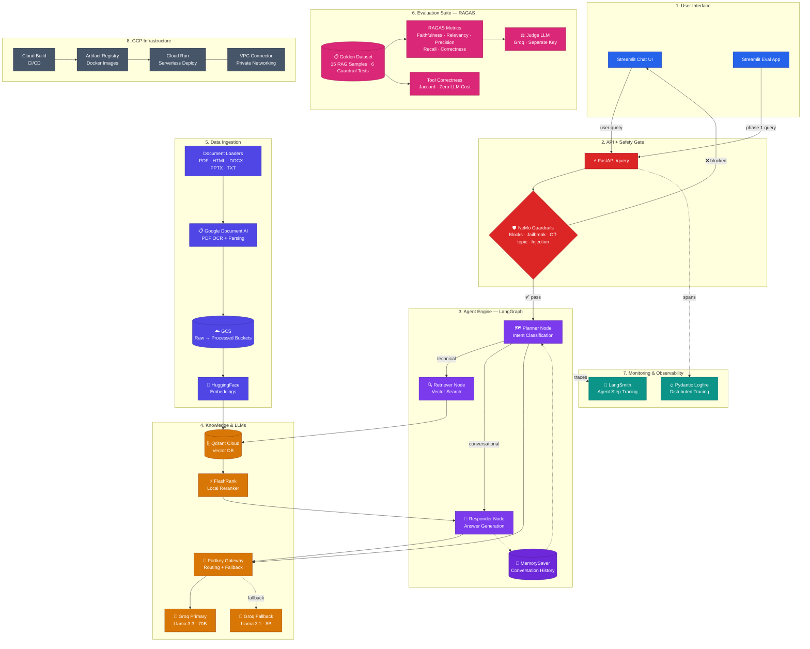
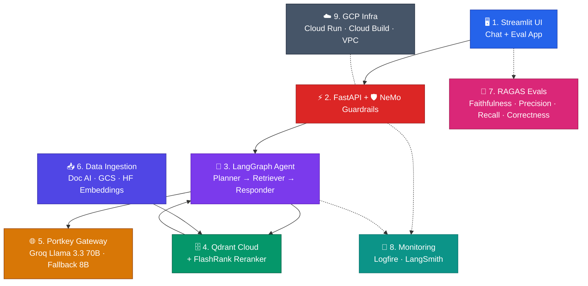

# Enterprise Agentic RAG: LangGraph · Guardrails · LLM Gateway · RAGAS Evals · GCP

```mermaid
graph LR

    %% ── Interfaces ───────────────────────────────────────────────────────────
    subgraph UI ["🖥️  Interface Layer"]
        direction TB
        CHAT["Streamlit\nChat UI"]
        EVAL_UI["Streamlit\nEval App"]
    end

    %% ── API + Safety ─────────────────────────────────────────────────────────
    subgraph SAFETY ["🛡️  API + Safety"]
        direction TB
        API["⚡ FastAPI\n/query"]
        GR{"NeMo\nGuardrails"}
    end

    %% ── LangGraph Agent ──────────────────────────────────────────────────────
    subgraph AGENT ["🧠  LangGraph Agentic Core"]
        direction TB
        PL["🗺️ Planner\nIntent Classification"]
        RT["🔍 Retriever\nVector Search"]
        RS["💬 Responder\nAnswer Generation"]
        MEM[("💾 MemorySaver\nConversation History")]
    end

    %% ── Retrieval ────────────────────────────────────────────────────────────
    subgraph RETRIEVAL ["🔎  Retrieval Layer"]
        direction TB
        QD[("🗄️ Qdrant Cloud\nVector DB")]
        FR["⚡ FlashRank\nLocal Reranker"]
    end

    %% ── LLM Gateway ──────────────────────────────────────────────────────────
    subgraph GATEWAY ["🌐  LLM Gateway"]
        direction TB
        PK["🔀 Portkey\nUnified Gateway"]
        G1["🦙 Groq Primary\nLlama 3.3 · 70B"]
        G2["🦙 Groq Fallback\nLlama 3.1 · 8B"]
    end

    %% ── Ingestion ────────────────────────────────────────────────────────────
    subgraph INGEST ["📥  Ingestion Pipeline"]
        direction TB
        LOADER["Document Loaders\nPDF · HTML · DOCX · PPTX · TXT"]
        DOCAI["📋 Google\nDocument AI"]
        GCS1[("☁️ GCS\nRaw Bucket")]
        GCS2[("☁️ GCS\nProcessed Bucket")]
        EMB["🔢 HuggingFace\nEmbeddings"]
    end

    %% ── Observability ────────────────────────────────────────────────────────
    subgraph OBS ["📡  Observability"]
        direction LR
        LF["🔥 Pydantic\nLogfire"]
        LS["🦜 LangSmith\nTracing"]
    end

    %% ── Evals ────────────────────────────────────────────────────────────────
    subgraph EVALS ["🧪  RAGAS Evaluation Suite"]
        direction LR
        GD[("📋 Golden Dataset\n15 Samples · 6 Guardrail Tests")]
        RAGAS["RAGAS Metrics\nFaithfulness · Relevancy\nPrecision · Recall · Correctness"]
        TC["Tool Correctness\nJaccard · Zero LLM"]
        JUDGE["⚖️ Judge LLM\nGroq · JUDGE_GROQ Key"]
    end

    %% ── GCP Infrastructure ───────────────────────────────────────────────────
    subgraph GCP ["☁️  Google Cloud Platform Infrastructure"]
        direction LR
        CR["Cloud Run\nServerless"]
        CB["Cloud Build\nCI/CD"]
        AR["Artifact\nRegistry"]
        VPC["VPC Connector\nPrivate Networking"]
    end

    %% ── Main Query Flow ──────────────────────────────────────────────────────
    CHAT -->|query| API
    API --> GR
    GR -->|"❌ blocked"| CHAT
    GR -->|"✅ pass"| PL
    PL -->|conversational| RS
    PL -->|technical| RT
    RT --> QD
    QD --> FR
    FR --> RS
    RS --> PK
    PL --> PK
    PK --> G1
    PK -.->|fallback| G2
    RS -.-> MEM
    MEM -.-> PL

    %% ── Ingestion Flow ───────────────────────────────────────────────────────
    LOADER --> DOCAI
    LOADER --> GCS1
    DOCAI --> GCS2
    GCS2 --> EMB
    EMB --> QD

    %% ── Eval Flow ────────────────────────────────────────────────────────────
    EVAL_UI -->|phase 1| API
    GD --> RAGAS
    GD --> TC
    RAGAS --> JUDGE

    %% ── Observability Traces ─────────────────────────────────────────────────
    API -.->|spans| LF
    AGENT -.->|traces| LS

    %% ── Infra ────────────────────────────────────────────────────────────────
    CB --> AR
    AR --> CR
    CR --- VPC

    %% ── Colors ───────────────────────────────────────────────────────────────
    classDef ui        fill:#3B82F6,stroke:#1D4ED8,color:#fff,rx:8
    classDef safety    fill:#EF4444,stroke:#B91C1C,color:#fff,rx:8
    classDef agent     fill:#8B5CF6,stroke:#6D28D9,color:#fff,rx:8
    classDef retrieval fill:#10B981,stroke:#047857,color:#fff,rx:8
    classDef gateway   fill:#F59E0B,stroke:#B45309,color:#fff,rx:8
    classDef ingest    fill:#6366F1,stroke:#4338CA,color:#fff,rx:8
    classDef obs       fill:#14B8A6,stroke:#0F766E,color:#fff,rx:8
    classDef evals     fill:#EC4899,stroke:#BE185D,color:#fff,rx:8
    classDef infra     fill:#64748B,stroke:#334155,color:#fff,rx:8
    classDef memory    fill:#7C3AED,stroke:#5B21B6,color:#fff,rx:8

    class CHAT,EVAL_UI ui
    class API,GR safety
    class PL,RT,RS agent
    class QD,FR retrieval
    class PK,G1,G2 gateway
    class LOADER,DOCAI,GCS1,GCS2,EMB ingest
    class LF,LS obs
    class GD,RAGAS,TC,JUDGE evals
    class CR,CB,AR,VPC infra
    class MEM memory
```

---

## System Architecture — Portal View

```mermaid
graph TB

    subgraph UI ["1. User Interface"]
        direction LR
        CHAT["Streamlit Chat UI"]
        EAPP["Streamlit Eval App"]
    end

    subgraph SAFETY ["2. API + Safety Gate"]
        direction LR
        API["⚡ FastAPI  /query"]
        GR{"🛡️ NeMo Guardrails\nBlocks · Jailbreak · Off-topic · Injection"}
    end

    subgraph AGENT ["3. Agent Engine  —  LangGraph"]
        direction LR
        PL["🗺️ Planner Node\nIntent Classification"]
        RT["🔍 Retriever Node\nVector Search"]
        RS["💬 Responder Node\nAnswer Generation"]
        MEM[("💾 MemorySaver\nConversation History")]
    end

    subgraph KNOWLEDGE ["4. Knowledge & LLMs"]
        direction LR
        QD[("🗄️ Qdrant Cloud\nVector DB")]
        FR["⚡ FlashRank\nLocal Reranker"]
        PK["🔀 Portkey Gateway\nRouting + Fallback"]
        G1["🦙 Groq Primary\nLlama 3.3 · 70B"]
        G2["🦙 Groq Fallback\nLlama 3.1 · 8B"]
    end

    subgraph INGEST ["5. Data Ingestion"]
        direction LR
        LOAD["Document Loaders\nPDF · HTML · DOCX · PPTX · TXT"]
        DOCAI["📋 Google Document AI\nPDF OCR + Parsing"]
        GCS[("☁️ GCS\nRaw → Processed Buckets")]
        EMB["🔢 HuggingFace\nEmbeddings"]
    end

    subgraph EVALS ["6. Evaluation Suite  —  RAGAS"]
        direction LR
        GD[("📋 Golden Dataset\n15 RAG Samples · 6 Guardrail Tests")]
        RAGAS["RAGAS Metrics\nFaithfulness · Relevancy · Precision\nRecall · Correctness"]
        TC["Tool Correctness\nJaccard · Zero LLM Cost"]
        JG["⚖️ Judge LLM\nGroq · Separate Key"]
    end

    subgraph OBS ["7. Monitoring & Observability"]
        direction LR
        LF["🔥 Pydantic Logfire\nDistributed Tracing"]
        LS["🦜 LangSmith\nAgent Step Tracing"]
    end

    subgraph GCP ["8. GCP Infrastructure"]
        direction LR
        CR["Cloud Run\nServerless Deploy"]
        CB["Cloud Build\nCI/CD"]
        AR["Artifact Registry\nDocker Images"]
        VPC["VPC Connector\nPrivate Networking"]
    end

    %% ── Query Flow ───────────────────────────────────────────────────────────
    CHAT -->|user query| API
    EAPP -->|phase 1 query| API
    API --> GR
    GR -->|"❌ blocked"| CHAT
    GR -->|"✅ pass"| PL
    PL -->|"technical"| RT
    PL -->|"conversational"| RS
    RT --> QD
    QD --> FR
    FR --> RS
    RS --> PK
    PL --> PK
    PK --> G1
    PK -.->|"fallback"| G2
    RS -.-> MEM
    MEM -.-> PL

    %% ── Ingestion Flow ───────────────────────────────────────────────────────
    LOAD --> DOCAI
    DOCAI --> GCS
    GCS --> EMB
    EMB --> QD

    %% ── Eval Flow ────────────────────────────────────────────────────────────
    GD --> RAGAS
    GD --> TC
    RAGAS --> JG

    %% ── Observability ────────────────────────────────────────────────────────
    API -.->|"spans"| LF
    AGENT -.->|"traces"| LS

    %% ── Infra ────────────────────────────────────────────────────────────────
    CB --> AR --> CR
    CR --- VPC

    %% ── Colours ──────────────────────────────────────────────────────────────
    classDef ui        fill:#2563EB,stroke:#1E40AF,color:#fff
    classDef safety    fill:#DC2626,stroke:#991B1B,color:#fff
    classDef agent     fill:#7C3AED,stroke:#5B21B6,color:#fff
    classDef knowledge fill:#D97706,stroke:#92400E,color:#fff
    classDef ingest    fill:#4F46E5,stroke:#3730A3,color:#fff
    classDef evals     fill:#DB2777,stroke:#9D174D,color:#fff
    classDef obs       fill:#0D9488,stroke:#0F766E,color:#fff
    classDef infra     fill:#475569,stroke:#1E293B,color:#fff
    classDef memory    fill:#6D28D9,stroke:#4C1D95,color:#fff

    class CHAT,EAPP ui
    class API,GR safety
    class PL,RT,RS agent
    class QD,FR,PK,G1,G2 knowledge
    class LOAD,DOCAI,GCS,EMB ingest
    class GD,RAGAS,TC,JG evals
    class LF,LS obs
    class CR,CB,AR,VPC infra
    class MEM memory
```

---

## System Architecture — Compact Portal View

```mermaid
graph TB
    A["🖥️ 1. Streamlit UI\nChat + Eval App"]
    B["⚡ 2. FastAPI + 🛡️ NeMo Guardrails"]
    C["🧠 3. LangGraph Agent\nPlanner → Retriever → Responder"]
    D["🗄️ 4. Qdrant Cloud\n+ FlashRank Reranker"]
    E["🌐 5. Portkey Gateway\nGroq Llama 3.3 70B · Fallback 8B"]
    F["📥 6. Data Ingestion\nDoc AI · GCS · HF Embeddings"]
    G["🧪 7. RAGAS Evals\nFaithfulness · Precision · Recall · Correctness"]
    H["📡 8. Monitoring\nLogfire · LangSmith"]
    I["☁️ 9. GCP Infra\nCloud Run · Cloud Build · VPC"]

    A --> B --> C
    C --> D --> C
    C --> E
    F --> D
    A -.-> G
    B -.-> H
    C -.-> H
    I -.- B

    classDef ui      fill:#2563EB,stroke:#1E40AF,color:#fff
    classDef safety  fill:#DC2626,stroke:#991B1B,color:#fff
    classDef agent   fill:#7C3AED,stroke:#5B21B6,color:#fff
    classDef db      fill:#059669,stroke:#065F46,color:#fff
    classDef llm     fill:#D97706,stroke:#92400E,color:#fff
    classDef ingest  fill:#4F46E5,stroke:#3730A3,color:#fff
    classDef evals   fill:#DB2777,stroke:#9D174D,color:#fff
    classDef obs     fill:#0D9488,stroke:#0F766E,color:#fff
    classDef infra   fill:#475569,stroke:#1E293B,color:#fff

    class A ui
    class B safety
    class C agent
    class D db
    class E llm
    class F ingest
    class G evals
    class H obs
    class I infra
```
