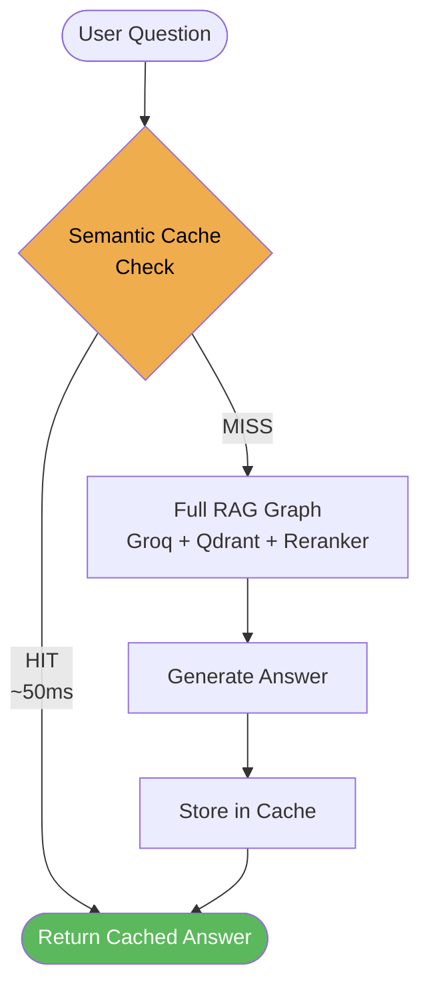

# Redis Semantic Caching

## Overview

The Redis layer (GCP Memorystore) provides **one function**: semantic caching of LLM responses.

> **Note:** Conversation memory across sessions is handled by **Postgres (PostgresSaver)**, not Redis. Redis is purely a performance layer.

---

## Semantic Caching

Before the RAG graph runs, `app/services/gcp/redis_semantic_cache.py` checks whether a semantically similar question has already been answered.



### How it Works

1. **Embed the query** — Vertex AI `text-embedding-004` converts the question to a 768-dim vector
2. **Scan Redis** — Fetch all cached entries (key prefix `sem_cache:`) and compare cosine distance
3. **Threshold check** — If distance < `0.15`, serve the cached answer instantly
4. **On cache miss** — Run the full RAG graph, then store the result in Redis with a 1-hour TTL

### Why Cosine Distance, Not Exact Key Match

Traditional caches require an exact string match:
- `"What is HPA?"` vs `"What is Horizontal Pod Autoscaling?"` = **MISS** (exact cache)
- `"What is HPA?"` vs `"What is Horizontal Pod Autoscaling?"` = **HIT** (semantic cache, ~0.08 distance)

### Implementation Detail

We use plain **`redis-py`** + **`numpy`** for cosine similarity — no extra libraries like `redisvl` needed:

```python
# app/services/gcp/redis_semantic_cache.py
DISTANCE_THRESHOLD = 0.15  # cosine distance — lower = stricter match
CACHE_TTL          = 3600  # 1 hour
KEY_PREFIX         = "sem_cache:"

def check_cache(query: str) -> str | None:
    query_vec = embed_texts([query])[0]
    for key in redis_client.scan_iter(f"{KEY_PREFIX}*"):
        entry = json.loads(redis_client.get(key))
        cached_vec = entry["embedding"]
        distance = 1 - cosine_similarity(query_vec, cached_vec)
        if distance < DISTANCE_THRESHOLD:
            return entry["answer"]
    return None
```

### Tuning the Threshold

| Value | Behaviour |
|-------|-----------|
| `0.10` | Very strict — only near-identical phrasings hit |
| `0.15` | Recommended — catches paraphrases, blocks off-topic queries |
| `0.30` | Loose — may serve wrong answers for vaguely related questions |

### Cost Impact

| Scenario | Without Cache | With Cache |
|----------|--------------|------------|
| Same question asked twice | 2 × Groq calls | 1 Groq call + 1 Redis lookup |
| 100 users ask the same FAQ | 100 × Groq calls | 1 Groq call + 99 × ~50ms Redis hits |
| LLM provider down | All requests fail | Cached questions still work |

---

## Local vs Production

| Environment | Behaviour |
|-------------|-----------|
| **Local** (`USE_SEMANTIC_CACHE=false`) | Cache disabled — Redis is not reachable from your laptop without a VPN tunnel into the VPC |
| **Cloud Run** (`USE_SEMANTIC_CACHE=true`) | Redis private IP (`10.x.x.x`) is reachable via direct VPC egress configured in Terraform |

The cache is controlled by the `USE_SEMANTIC_CACHE` env var set in `terraform/cloud_run.tf`. Set it to `false` to disable caching for debugging.

---

## See Also

- `app/services/gcp/redis_semantic_cache.py` — full implementation
- `app/main.py` — where cache check/store gates wrap the RAG graph
- `DOCS/22_STEP_4_SEMANTIC_CACHE.md` — architecture decision rationale
- `DOCS/20_STEP_2_POSTGRES_MEMORY.md` — conversation memory (Postgres, not Redis)
