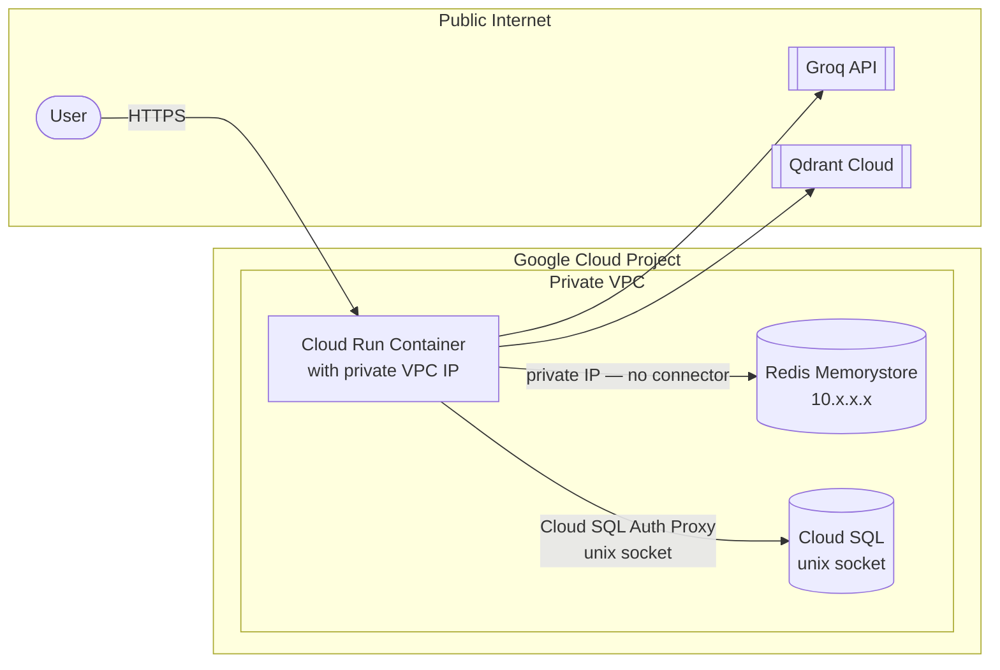

# VPC Networking: How Cloud Run Reaches Private Services

This document explains how Cloud Run services communicate privately with Cloud SQL and Redis without going over the public internet.

---

## The Problem: Cloud Run vs Private Services

By default, Cloud Run containers run in Google's managed environment — outside your project's VPC. Redis (Memorystore) and Cloud SQL are provisioned with private IP addresses inside your VPC and are invisible to the public internet.

```
Cloud Run (outside VPC)  ←— cannot reach —→  Redis 10.x.x.x (inside VPC)
```

There are two ways to bridge this gap:

| Approach | How | Cost | Speed |
|---|---|---|---|
| **VPC Access Connector** (old) | A shared, managed proxy resource deployed into a subnet | Extra cost (~$50+/month for idle connector) | Slower — traffic hops through connector |
| **Direct VPC Egress** (our approach) | Container network interface attached directly to the VPC subnet | No extra resource — included in Cloud Run gen2 | Faster — direct layer 3 routing |

---

## Our Solution: Direct VPC Egress

Instead of routing traffic through a VPC Connector, we attach the Cloud Run container directly to a VPC subnet using the `network_interfaces` block in Terraform. This gives the container a private IP address inside the VPC — it can reach Redis, Cloud SQL, and any other VPC-internal resource directly.



### How It's Configured in Terraform

```hcl
# terraform/cloud_run.tf
template {
  vpc_access {
    network_interfaces {
      network    = google_compute_network.vpc.name
      subnetwork = google_compute_subnetwork.subnet.name
    }
    egress = "ALL_TRAFFIC"
  }
}
```

`egress = "ALL_TRAFFIC"` means all outbound traffic (including calls to Groq and Qdrant Cloud) flows through the VPC. This keeps routing simple and consistent — no split-brain between VPC and internet traffic.

---

## Why Not a VPC Connector?

The Serverless VPC Access Connector (`google_vpc_access_connector`) is the older approach and still works — but:

- It requires a dedicated resource with its own subnet CIDR range and minimum instance count
- It adds latency (traffic proxied through the connector, not routed directly)
- It costs money even when idle
- It is provisioned separately and must be sized correctly upfront

Direct VPC egress is available on Cloud Run gen2 (which is the default since 2023) and requires no extra resource — just the `network_interfaces` block.

---

## Cloud SQL: Unix Socket, Not TCP

Redis is reached by private IP. Cloud SQL is reached differently — via a Unix socket at `/cloudsql/{connection_name}`. The Cloud SQL Auth Proxy runs as a sidecar inside the Cloud Run container. This means:

- No TCP port open for Cloud SQL — the public IP exists but no `authorized_networks` are whitelisted
- Authentication uses IAM, not password-only
- The connection string uses the socket path as the host:

```
host=/cloudsql/project:region:instance  dbname=...  user=...  password=...
```

---

## Security Properties

| What | How |
|---|---|
| Redis is not reachable from the internet | Memorystore only has a private IP; no public endpoint |
| Cloud SQL is not reachable via TCP | `ipv4_enabled = true` but no `authorized_networks` — proxy-only access |
| Cloud Run to Redis | Direct VPC egress — traffic stays on Google's private fiber |
| Cloud Run to Groq/Qdrant | Outbound HTTPS over public internet, encrypted in transit |

---

## See Also

- `terraform/cloud_run.tf` — `vpc_access.network_interfaces` block
- `terraform/main.tf` — VPC and subnet definitions
- `DOCS/24_INFRASTRUCTURE_AS_CODE_TERRAFORM.md` — full Terraform overview
- `DOCS/20_STEP_2_POSTGRES_MEMORY.md` — Cloud SQL unix socket connection details
