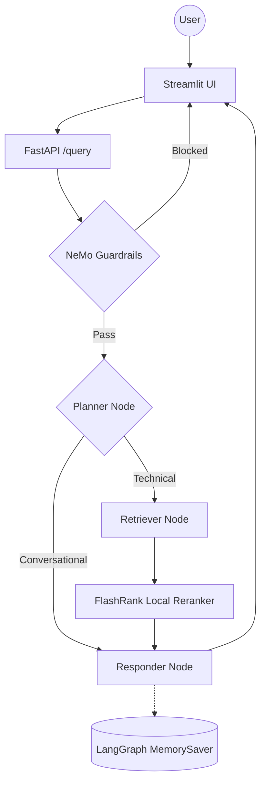

# Enterprise Agentic RAG (Scalable Pipeline)

A production-grade, enterprise-level scalable RAG system built with **LangGraph**, **Google Cloud Platform (GCP)**, and a **Portkey LLM Gateway**. The system distinguishes between technical "True Data" and random "Noisy Data" using semantic re-ranking, history-aware planning, and NeMo Guardrails for input/output safety.

## Key Features

- **Agentic Intelligence**: LangGraph for cyclic reasoning, multi-step planning, and conversation memory.
- **Guardrails**: NeMo Guardrails gate blocks off-topic, jailbreak, and injection inputs before any retrieval.
- **LLM Gateway**: Portkey routes all LLM calls with automatic fallback between primary and backup Groq keys.
- **Enterprise Search**: Qdrant Cloud for high-performance vector search + FlashRank for local semantic reranking.
- **Observability**: Full trace nesting with **Pydantic Logfire** and **LangSmith** across every agent node.
- **Evaluation Suite**: RAGAS-powered eval pipeline (6 metrics) with a dedicated Streamlit demo app.
- **Scalable Infrastructure**: Deployed on **Google Cloud Run** with Cloud Build CI/CD and VPC Connectors.

---

## Agent Intelligence Flow



---

## Project Structure

```text
├── app/
│   ├── agents/
│   │   └── nodes/       # Planner, Retriever, Responder LangGraph nodes
│   ├── gateway/         # Portkey LLM gateway — primary + fallback Groq routing
│   ├── guardrails/      # NeMo Guardrails input/output filtering
│   ├── ingestion/
│   │   ├── chunking/    # Text splitting strategies
│   │   └── loaders/     # PDF (Document AI), HTML, TXT, DOCX, PPTX parsers
│   ├── services/
│   │   └── retrieval/   # Qdrant vector search + FlashRank reranking
│   ├── config.py        # Centralized environment variable management
│   └── main.py          # FastAPI entrypoint — guardrails gate + /query endpoint
├── evals/               # RAGAS evaluation suite + Streamlit 3-tab demo
├── ui/                  # Streamlit chat interface with reasoning step transparency
├── DOCS/                # 18 architectural and operational guides
├── DATA/                # Sample datasets (True vs Noisy documentation)
├── Dockerfile           # Production container — serves app/ via uvicorn
└── requirements.txt     # Locked dependencies
```

---

## Tech Stack

| Layer | Technology |
|-------|-----------|
| Orchestration | LangChain + LangGraph |
| LLMs | Groq (Llama 3.3 70B) via **Portkey** gateway |
| Guardrails | NeMo Guardrails |
| Vector DB | Qdrant Cloud |
| Reranking | FlashRank (local, zero-latency) |
| Embeddings | HuggingFace sentence-transformers |
| Cloud Compute | Google Cloud Run (Serverless) |
| Cloud Storage | Google Cloud Storage (GCS) |
| Document Parsing | Google Document AI (PDF) |
| Observability | Pydantic Logfire + LangSmith |
| Evaluation | RAGAS + custom Tool Correctness (Jaccard) |

---

## Getting Started

### 1. Install dependencies

```powershell
python -m venv tenvv
.\tenvv\Scripts\activate
pip install -r requirements.txt
```

### 2. Configure environment

Create a `.env` file — see `commands.md` Section 2 for all required keys (Groq, Qdrant, GCP, Portkey, Logfire, LangSmith, JUDGE_GROQ for evals).

### 3. Run data ingestion

```powershell
python -m app.ingestion.processor DATA --wipe
```

### 4. Launch the app

```powershell
# Terminal 1 — FastAPI backend
uvicorn app.main:app --reload --port 8000

# Terminal 2 — Streamlit UI
streamlit run ui/app.py
```

### 5. Run the eval suite (optional)

```powershell
# Requires the FastAPI backend running on :8000
streamlit run evals/app.py
```

---

## Documentation Index

| # | Guide | What it covers |
|---|-------|---------------|
| 1 | [System Overview](DOCS/01_SYSTEM_OVERVIEW.md) | High-level vision and end-to-end flow |
| 2 | [Ingestion Engine](DOCS/02_INGESTION_ENGINE.md) | Document parsing and indexing pipeline |
| 3 | [Node Intelligence](DOCS/03_NODE_INTELLIGENCE.md) | Planner, Retriever, Responder internals |
| 4 | [Observability](DOCS/04_TRACING_AND_OBSERVABILITY.md) | Logfire + LangSmith tracing |
| 5 | [GCP Prod Setup](DOCS/05_GCP_PROD_SETUP.md) | Step-by-step infrastructure provisioning |
| 6 | [Deployment Strategy](DOCS/06_DEPLOYMENT_STRATEGY.md) | Cloud Build and Cloud Run details |
| 7 | [Env Variables](DOCS/07_ENVIRONMENT_VARIABLES.md) | Complete configuration dictionary |
| 8 | [GCP Roles & Services](DOCS/08_GCP_ROLES_AND_SERVICES.md) | IAM and service breakdown |
| 9 | [Infra Architecture](DOCS/09_INFRA_ARCHITECTURE.md) | The 3-tier cloud blueprint |
| 10 | [Redis Caching](DOCS/10_REDIS_CACHING.md) | Response caching layer design |
| 11 | [Microservices Transition](DOCS/11_MICROSERVICES_TRANSITION.md) | Scaling beyond monolith |
| 12 | [Known Gotchas](DOCS/12_KNOWN_GOTCHAS.md) | GCP quirks and architectural decisions |
| 13 | [FlashRank Reranking](DOCS/13_FLASHRANK_RERANKING.md) | Local semantic reranker deep-dive |
| 14 | [VPC Networking](DOCS/14_VPC_NETWORKING.md) | Private networking and VPC connectors |
| 15 | [Guardrails](DOCS/15_GUARDRAILS.md) | NeMo Guardrails implementation |
| 16 | [LLM Gateway](DOCS/16_LLM_GATEWAY.md) | Portkey routing, fallback, and observability |
| 17 | [Evals](DOCS/17_EVALS.md) | RAGAS metrics theory and token budget |
| 18 | [Evals Pipeline](DOCS/18_EVALS_PIPELINE.md) | Live eval pipeline and Streamlit demo |

---

*Built for High-Scale Enterprise Document Intelligence.*
